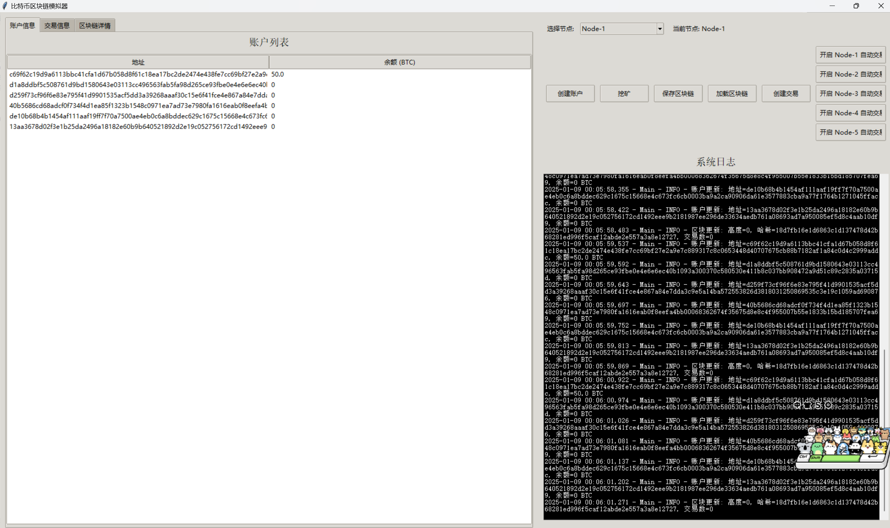

# Blockchain Simulator

A simulation of a basic blockchain system with support for multiple nodes, transactions, mining, and a graphical user interface (GUI) built with Tkinter. This project demonstrates fundamental blockchain concepts, including key pair generation, transaction handling, UTXO set management, mining with proof-of-work, and network communication among nodes.

## Features

- **Key Pair Generation**: Create ECDSA key pairs for accounts.
- **Transaction Management**: Create, sign, and verify transactions.
- **Blockchain Management**: Handle blocks, block headers, and chain validation.
- **Mining**: Simulate mining with proof-of-work and block rewards.
- **Network Simulation**: Manage communication between multiple nodes.
- **Graphical User Interface**: Visualize accounts, transactions, and blockchain status.
- **Logging**: Detailed logs for actions and events.

## Installation

### Prerequisites

- **Python 3.7 or higher**: Ensure Python is installed on your system.
- **Git**: For cloning the repository.

### Steps

1. **Clone the Repository**

   ```bash
   git clone https://github.com/Firmament11/BCSimulater.git
   cd blockchain-simulator
   ```

2. **Create a Virtual Environment (Optional but Recommended)**

   ```bash
   python -m venv venv
   source venv/bin/activate  # On Windows: venv\Scripts\activate
   ```

3. **Install Dependencies**

   ```bash
   pip install -r requirements.txt
   ```

## Usage

Run the main Python script to start the blockchain simulator and GUI:

```bash
python main.py
```

### GUI Features

- **Account Information**: View list of accounts and their balances.
- **Transaction Information**: Monitor transaction records.
- **Blockchain Details**: See the list of blocks, their hashes, and number of transactions.
- **Controls**:
  - Create New Account
  - Mine New Block
  - Save Blockchain to File
  - Load Blockchain from File
  - Create and Broadcast Transactions
  - Manage Automatic Transactions and Mining for Nodes

### Logging

Logs are stored in the `logs` directory in the `app.log` file.

## Contributing

Contributions are welcome! Please fork the repository and submit a pull request for any enhancements or bug fixes.

## License

[MIT License](LICENSE)

## Acknowledgements

- **ECDSA**: For cryptographic functions.
- **Tkinter**: For building the graphical user interface.
```

ecdsa>=0.13
```
